### 什么是 pprof
pprof是 GoLang 程序性能分析工具，prof是 profile（画像）的缩写, 对于应用程序来说，指的是对内存和CPU的信息采集

Go语言项目中的性能优化主要有以下几个方面：

> CPU profile：报告程序的 CPU 使用情况，按照一定频率去采集应用程序在 CPU 和寄存器上面的数据  
> Memory Profile（Heap Profile）：报告程序的内存使用情况  
> Block Profiling：报告 goroutines 不在运行状态的情况，可以用来分析和查找死锁等性能瓶颈  
> Goroutine Profiling：报告 goroutines 的使用情况，有哪些 goroutine，它们的调用关系是怎样的  
### 如何使用 pprof
Go语言内置了获取程序的运行数据的工具，包括以下两个标准库：

> runtime/pprof：采集工具型应用运行数据进行分析 
> 
> net/http/pprof：采集服务型应用运行时数据进行分析

### 演示
1. 下载代码
2. 启动 “炸弹” 程序
3. 采样 CPU 指标，为了节省时间，指定 seconds 参数为 10  

#### 命令行方式
```go
go tool pprof "http://localhost:6060/debug/pprof/profile?seconds=10"
```
等待10秒钟采样完成，自动进入 pprof 控制台


输入 top 命令查看占用资源最多的函数

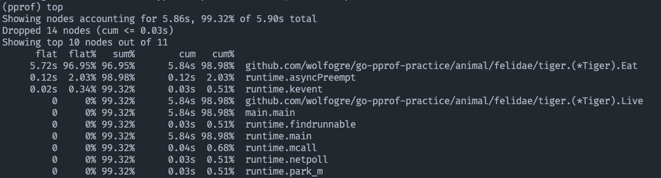
   
可以看到 `Eat` 这个函数占用了大约 96% 的 CPU 时间，可能是问题所在。  
输入 `list Eat` 查看当前函数

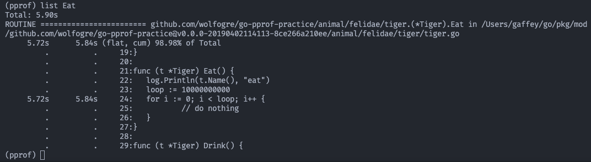
可以看到代码 24 行在执行一个循环， 这个循环执行次数是 loop 变量，达到了惊人的一百亿次，总耗时接近 6 秒。

至此定位到CPU性能问题

#### Web UI 方式
首先需要预先安装 Graphviz 以便查看调用关系图  
`brew install graphviz`  

在 pprof 交互模式下输入 `web` 命令会自动打开浏览器

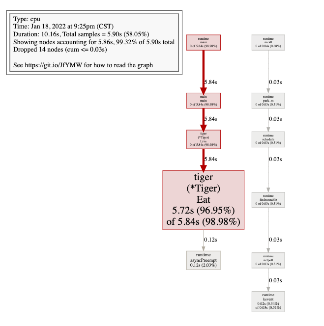


#### 其他问题排查
##### Heap 堆内存的使用
```go
go tool pprof -http=:8080 "http://localhost:6060/debug/pprof/heap"
```
这种携带 -http 参数会自动打开网页展示视图
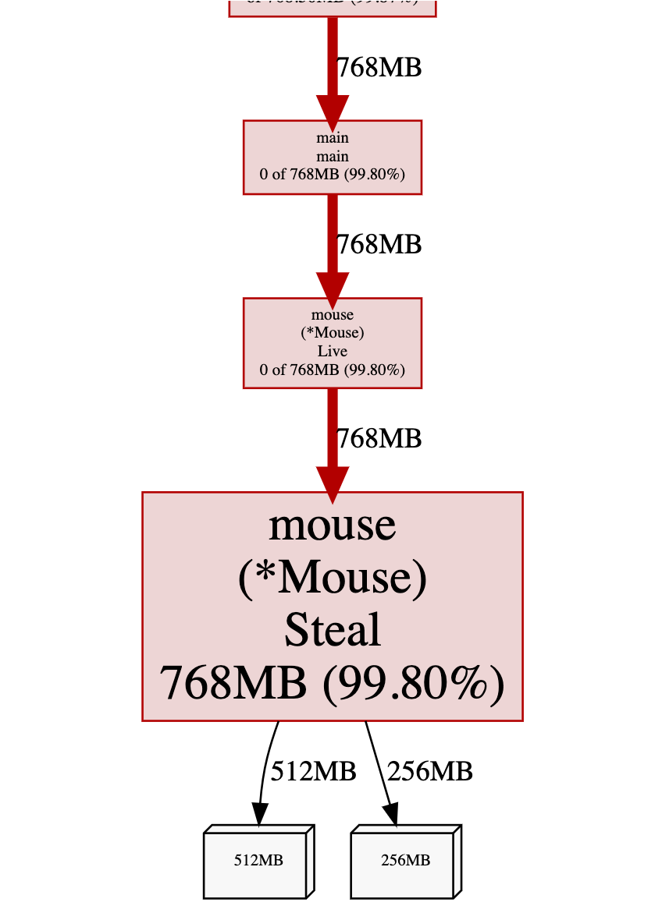
可以看到粗大的红色箭头定位到了 `Mouse.Live()` 有问题，占用了 `768M` 内存  
可以在网页中点击 `top` 选项以 top 的布局排版
点击 `source` 来定位问题代码 
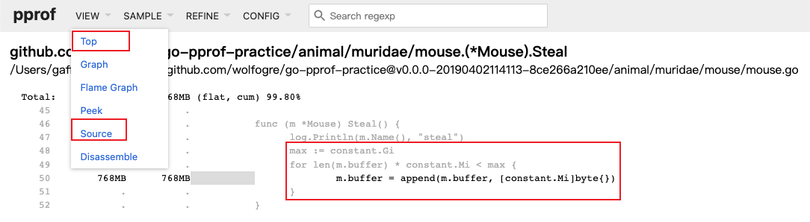

##### 内存分配
除了查看堆内存的占用情况外，还需要关注一下是否有频繁的内存分配，如果程序中有频繁的内存分配，会给 GC 带来很大的压力
这里我们点击网页中的 `alloc_space` 查看
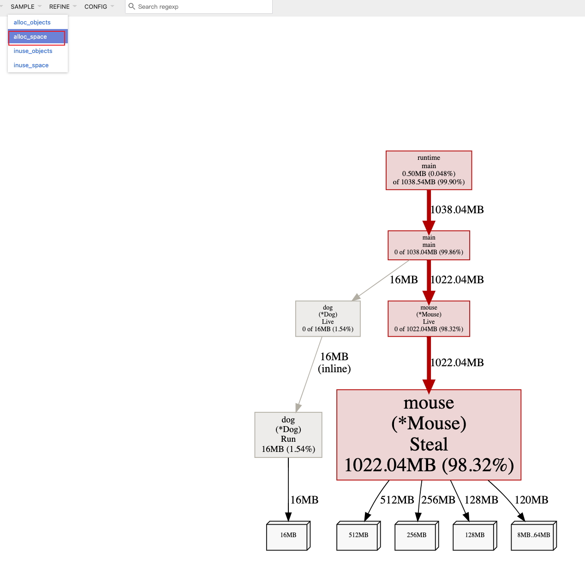
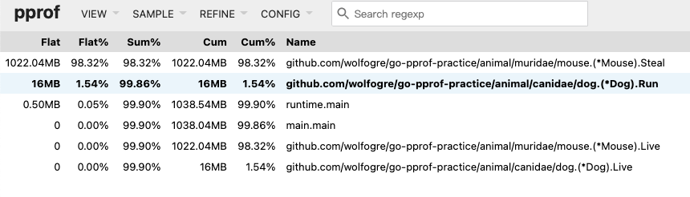
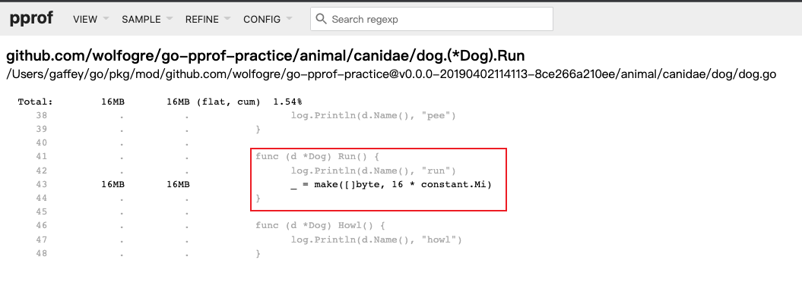
##### goroutine 泄漏
另外一个比较常见的性能问题是 goroutine 泄漏  
浏览器查看 `http://localhost:6060/debug/pprof` . 
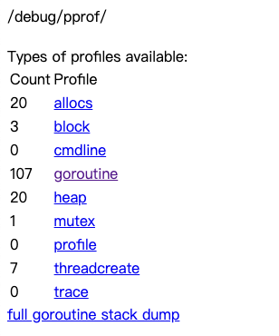
可以看到在我们的测试程序中，已经产生了 107 个协程，这对于一个 demo 程序来说是不合理的，利用同样的方法，打开网页查看发生了什么 
```go
go tool pprof -http=:8080 "http://localhost:6060/debug/pprof/goroutine"
```
由于协程之间的关系调用图非常长，我们可以使用火焰图的方式查看 
点击 `Flame Graph`  


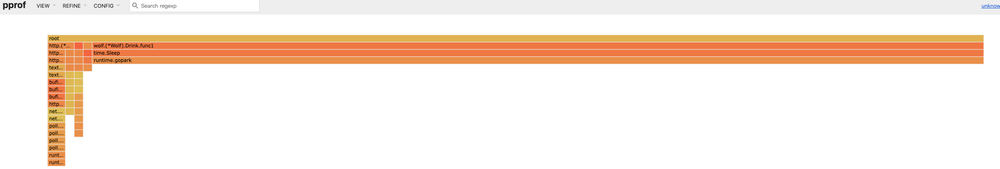	

图中展示了 `worf.Drink().func1` 有 `sleep` 函数的调用,来定位到代码看看是不是这样  

##### 阻塞
剩下的还有阻塞，互斥锁等排查，方法和前面一样，就直接放图了
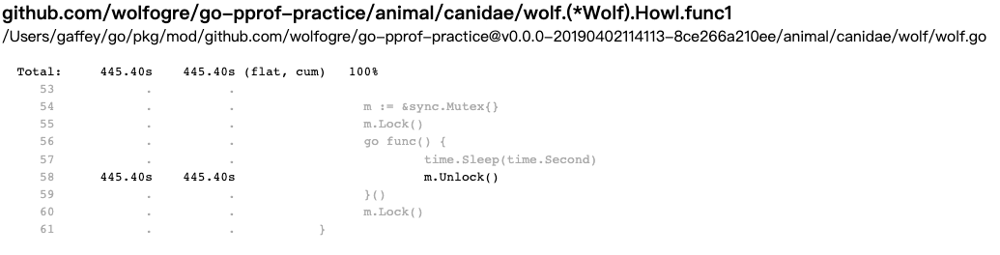
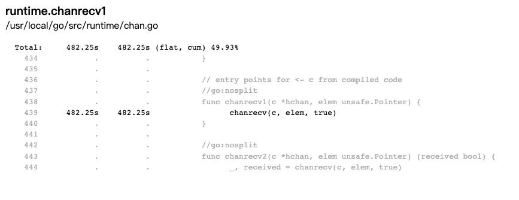
