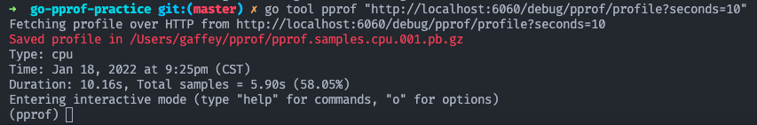

### 什么是 pprof

### 如何实践 pprof

#### 1. 一个 “炸弹” 程序
1. 下载代码
2. 启动 “炸弹” 程序
3. 采样 CPU 指标，为了节省时间，指定 seconds 参数为 10  
   ```go
   go tool pprof "http://localhost:6060/debug/pprof/profile?seconds=10"
   ```
   等待10秒钟采样完成，自动进入 pprof 控制台

   

   输入 top 命令查看占用资源最多的函数

   
   
   可以看到 Eat 这个函数占用了大约 96% 的 CPU 时间，可能是问题所在。
   输入 list Eat 查看当前函数

   
   可以看到代码 24 行在执行一个循环， 这个循环执行次数是 loop 变量，达到了惊人的一百亿次，总耗时接近 6 秒。

   安装 Graphviz 以便查看调用关系图
   `brew install graphviz`
   调用 web 命令生成调用关系图，更加直观
   

   拆除

   Heap 堆内存的使用
   go tool pprof -http=:8080 "http://localhost:6060/debug/pprof/heap"

   会自动打开网页展示内存视图
   
   可以看到 Mouse.Live() 有问题，占用了 768M 内存
   可以在网页中点击 top， 和 source 来定位代码
   
	隐藏的问题， 空分配
	
	
	
	goroutine 泄漏
	
	go tool pprof -http=:8080 "http://localhost:6060/debug/pprof/goroutine"
	
		
